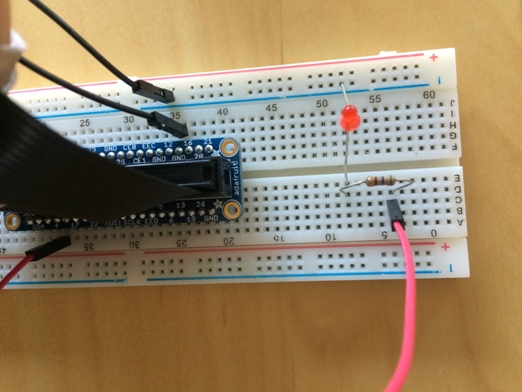
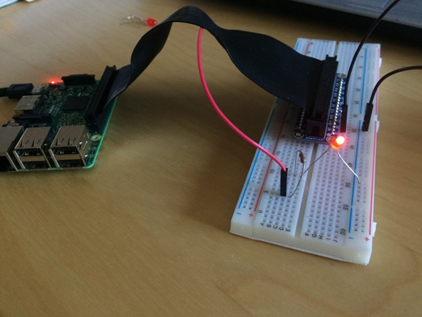
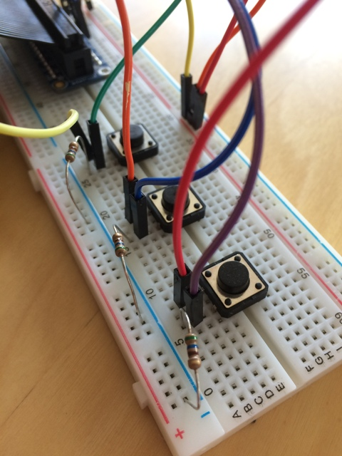
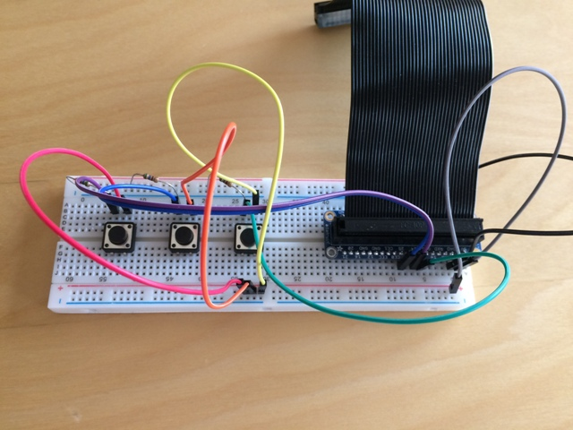

# Maker Projects  

* 3D Design and Printing  
* Adafruit LED Pendants  
* Circuit Building  

## Circuit Building  
### Creating Basic Circuits with Raspberry Pi  

Before we start making our connections from a Raspberry Pi (microcomputer) to a breadboard, we will learn and practice the basics of controlling electricity flow. This will include logic design (switching networks) and all of the devices involved; i.e. resistors, cables, buttons, and light emitting diodes (LEDs).  

**Simple Circuit (OFF)**  
  

***  
**Simple Circuit (ON)**  
  

***  

## Hardware Controlled by Python  

### Make a Soundboard  

blog.techemstudios.com/how-to-make-a-raspberry-pi-soundboard.html  

  

  
***  

